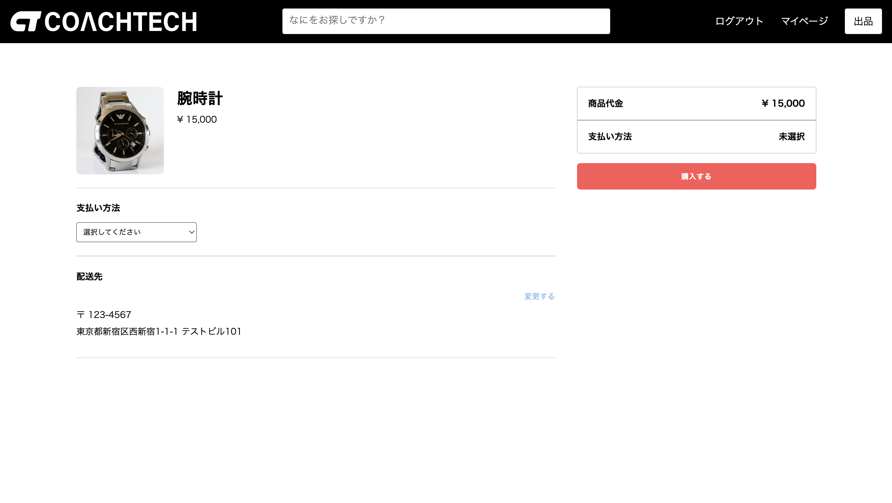
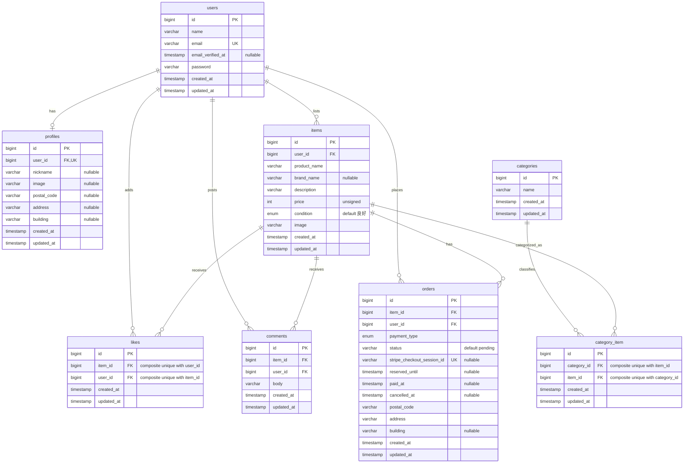

# COACHTECH FleaMarket

## プロジェクト概要

ユーザーが商品の出品・購入を行えるフリマWebアプリケーションです。

商品検索やいいね・コメント、プロフィール・配送先設定に加え、Stripe Checkoutを利用した決済処理を実装しています。

## 画面イメージ

| 商品一覧 | 商品詳細 |
| --- | --- |
|  |  |

| 購入画面 | マイページ |
| --- | --- |
|  |  |

## 主な機能

### 認証

- 会員登録
- ログイン・ログアウト
- メール認証
- 未認証ユーザーの一部機能制限

### 商品

- 商品一覧表示
- 商品名による部分一致検索
- マイリスト表示・検索
- 商品詳細表示
- 商品出品
- 複数カテゴリ設定
- 商品状態・価格・画像登録
- 出品済み商品の確認

### いいね・コメント

- いいね・いいね解除
- コメント投稿
- コメント文字数制限
- 取引中・売却済み商品へのコメント制限

### 購入

- 商品購入
- カード決済
- コンビニ決済
- 配送先変更
- 自分の商品の購入防止
- 二重購入防止
- 購入済み商品の確認
- 決済状態に応じた表示制御

### プロフィール

- プロフィール画像設定
- ユーザー名変更
- 郵便番号・住所・建物名設定

## 実装上のポイント

### Stripe Checkoutによる決済

Stripe Checkoutを利用し、カード決済・コンビニ決済に対応しています。

注文状態を以下の3種類で管理しています。

- `pending`：決済手続き中
- `paid`：決済完了
- `cancelled`：キャンセル・期限切れ

StripeのWebhookを利用し、決済結果をアプリケーション側へ反映します。

対応イベント：

- `checkout.session.completed`
- `checkout.session.async_payment_succeeded`
- `checkout.session.async_payment_failed`
- `checkout.session.expired`

カード決済は支払い完了後に即時確定し、コンビニ決済は非同期Webhookによって支払い完了を確定します。

### 二重購入防止

同じ商品を複数ユーザーが同時に購入しないよう、購入処理時にDBトランザクションと `lockForUpdate()` を使用しています。

決済中の商品は「取引中」、決済完了後は「Sold / 売却済み」として表示します。

### Stripe APIの責務分離

Stripe SDKへのアクセスは `StripePaymentService` に集約し、Controllerから外部APIへの直接依存を分離しています。

これにより、Feature TestではStripeサービスをモックし、実際のStripe APIへ通信せずに決済処理を検証できます。

### バリデーション

会員登録・ログイン・プロフィール・商品出品・コメント・購入・配送先変更などでFormRequestを使用し、入力検証の責務をControllerから分離しています。

### Seeder

デモ用の商品・カテゴリをSeederで作成しています。

商品画像は `public/images/items/` に配置しているため、GitHubからcloneした環境でも画像付きの商品データを再現できます。

Seederは再実行しても同じデモ商品・カテゴリが重複しないように実装しています。

## 使用技術

### Backend

- PHP 8.1
- Laravel 8.83.29
- Laravel Fortify

### Frontend

- Blade
- HTML
- CSS

### Database

- MySQL 8.0.36

### Infrastructure

- Docker
- Docker Compose
- Nginx 1.21.1

### External Services

- Stripe API
- MailHog

### Testing

- PHPUnit 9.6.28
- Mockery

## 環境構築

### 事前に必要な環境

- Git
- Docker Desktop
- Docker Compose v2

### 1. リポジトリをクローン

```bash
git clone https://github.com/aki11-20/coachtech-fleamarket.git
cd coachtech-fleamarket
```

### 2. Dockerコンテナをビルド・起動

```bash
docker compose up -d --build
```

### 3. PHPコンテナに入る

```bash
docker compose exec php bash
```

### 4. Laravelの依存パッケージをインストール

```bash
composer install
```

### 5. 環境設定ファイルを作成

```bash
cp .env.example .env
```

`.env` のデータベース設定を以下の内容に変更します。

```env
DB_CONNECTION=mysql
DB_HOST=mysql
DB_PORT=3306
DB_DATABASE=laravel_db
DB_USERNAME=laravel_user
DB_PASSWORD=laravel_pass
```

### 6. MailHog設定

```env
MAIL_MAILER=smtp
MAIL_HOST=mailhog
MAIL_PORT=1025
MAIL_USERNAME=null
MAIL_PASSWORD=null
MAIL_ENCRYPTION=null
MAIL_FROM_ADDRESS=example@example.com
MAIL_FROM_NAME="${APP_NAME}"
```

### 7. Stripe設定

Stripeのテストモードで取得した値を設定します。

```env
STRIPE_SECRET=sk_test_xxx
STRIPE_WEBHOOK_SECRET=whsec_xxx
```

実際のAPIキーはGit管理しないでください。

### 8. アプリケーションキーを生成

```bash
php artisan key:generate
```

### 9. Storageへのシンボリックリンクを作成

```bash
php artisan storage:link
```

### 10. マイグレーション・シーディング

```bash
php artisan migrate --seed
```

## Stripe Webhook

ローカル環境でWebhookを確認する場合は、Stripe CLIでログインします。

```bash
stripe login
```

次に、対応するWebhookイベントをアプリケーションへ転送します。

```bash
stripe listen \
  --events checkout.session.completed,checkout.session.async_payment_succeeded,checkout.session.async_payment_failed,checkout.session.expired \
  --forward-to http://localhost/api/stripe/webhook
```

`stripe listen` の実行時に表示される `whsec_...` を `.env` に設定してください。

```env
STRIPE_WEBHOOK_SECRET=whsec_xxx
```

`whsec_xxx` は例示用の値です。Webhook署名はこの環境変数を使用して検証します。実際の署名シークレットはGit管理しないでください。

## URL

- アプリケーション: http://localhost/
- phpMyAdmin: http://localhost:8080
- MailHog: http://localhost:8025

## 出品者用デモアカウント

以下はローカル環境でSeederにより作成される出品者用アカウントです。

```text
メールアドレス: test@example.com
パスワード: password123
```

## PHPUnit

通常DBとは別に `demo_test` を使用します。

### テストDBを作成

```bash
docker compose exec mysql mysql -uroot -proot -e \
"CREATE DATABASE IF NOT EXISTS demo_test CHARACTER SET utf8mb4 COLLATE utf8mb4_unicode_ci; GRANT ALL PRIVILEGES ON demo_test.* TO 'laravel_user'@'%'; FLUSH PRIVILEGES;"
```

### テストを実行

```bash
docker compose exec php ./vendor/bin/phpunit
```

Stripe関連のFeature Testでは `StripePaymentService` をモックしているため、Stripe APIへの実通信は発生しません。

実行結果：

```text
67 tests, 311 assertions
すべて成功
```

## ER図


