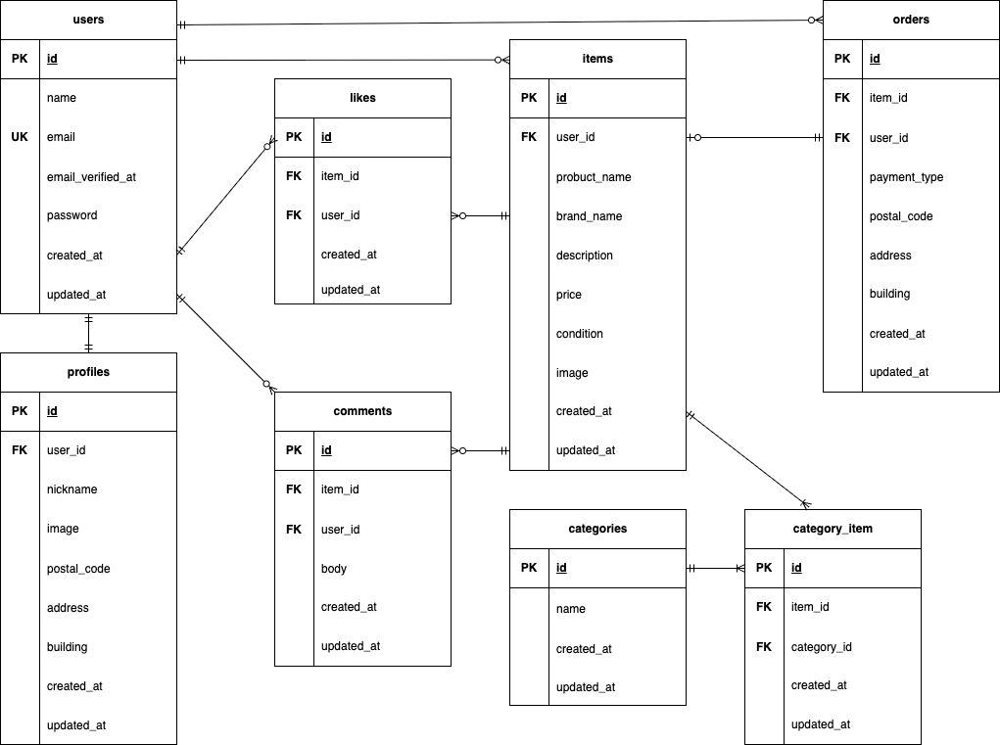

# COACHTECH FleaMarket

## プロジェクト概要

ユーザーが商品を出品・購入できるフリマアプリです。

- 出品
- 商品一覧/詳細/いいね/コメント
- 購入
- プロフィール設定

## 環境構築

### リポジトリのクローン

1. git clone git@github.com:aki11-20/coachtech-fleamarket.git

### Docker ビルド・起動

2. docker-compose up -d --build

### PHP コンテナ

3. docker-compose exec php bash

### Laravel 環境構築

4. composer install
5. cp .env.example .env
6. php artisan key:generate

### マイグレーション＆シーディング

7. php artisan migrate --seed

### .env 設定

8. MAIL_MAILER=smtp
   MAIL_HOST=mailhog
   MAIL_PORT=1025
   MAIL_USERNAME=null
   MAIL_PASSWORD=null
   MAIL_ENCRYPTION=null
   MAIL_FROM_ADDRESS=example@example.com
   MAIL_FROM_NAME="${APP_NAME}"
   STRIPE_PUBLIC=YOUR_STRIPE_PUBLIC_KEY_TEST
   STRIPE_SECRET=YOUR_STRIPE_SECRET_KEY_TEST
   STRIPE_PRICE_ID=price_xxx
   STRIPE_SUCCESS_URL=http://localhost/success
   STRIPE_CANCEL_URL=http://localhost/cancel

## 使用技術

- PHP 8.4.10
- PHP(Docker コンテナ)8.1.33
- Laravel 8.83.29
- Composer 2.8.12
- MySQL 8.0.36
- Nginx 1.21.1
- Stripe API (決済)
- Mailhog (メール認証テスト)

## ER 図

## URL

- 開発環境: http://localhost/
- phpMyAdmin: http://localhost:8080
- Mailhog UI (認証メール確認): http://localhost:8025

## テスト

1. docker-compose exec php bash
2. vendor/bin/phpunit

## ログイン情報

- メール: test@example.com
- パスワード: password123
